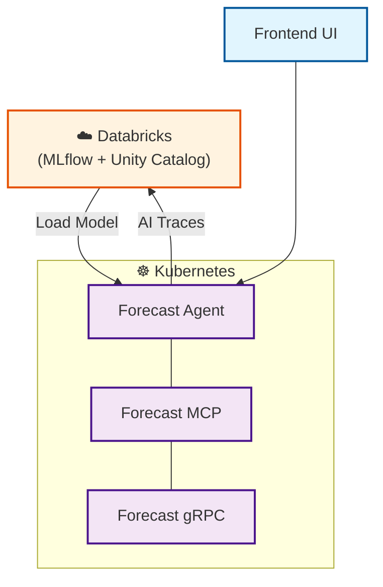

## Architecture

## Inference

```mermaid
flowchart TB
    Databricks["☁️ Databricks<br/>(MLflow + Unity Catalog)"]

    subgraph K8s["☸️ Kubernetes"]
        Agent["Forecast Agent"]
        MCP["Forecast MCP"]
        gRPC["Forecast gRPC"]
    end

    UI["Frontend UI"]

    Databricks -->|Load Model| Agent
    Agent -->|AI Traces| Databricks
    Agent --- MCP
    MCP --- gRPC
    UI ---> Agent

    classDef uiStyle fill:#e1f5fe,stroke:#01579b,stroke-width:2px
    classDef k8sStyle fill:#f3e5f5,stroke:#4a148c,stroke-width:2px
    classDef databricksStyle fill:#fff3e0,stroke:#e65100,stroke-width:2px

    class UI uiStyle
    class Agent,MCP,gRPC k8sStyle
    class Databricks databricksStyle
```
